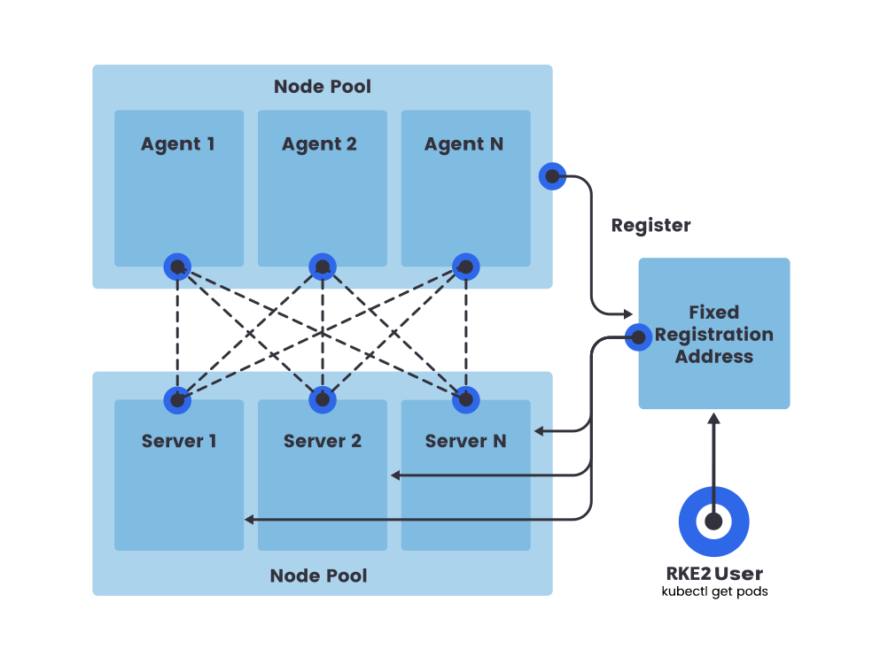

# 02 – RKE2 高可用安裝（3 Control-Plane）

> 來源：
> - [https://docs.rke2.io/install/ha](https://docs.rke2.io/install/ha)
> - [https://docs.rke2.io/install/quickstart](https://docs.rke2.io/install/quickstart)
> - [https://docs.rke2.io/install/methods](https://docs.rke2.io/install/methods)
> 整理日期：2026-05-26
> 目標版本：RKE2 v1.35.x（stable channel）

---

## 1. HA 架構概念



> *圖片來源：[docs.rke2.io – HA Installation](https://docs.rke2.io/install/ha)*

HA 叢集三大要素（[來源](https://docs.rke2.io/install/ha)）：

1. **奇數個 Server 節點**（建議 3 個）：執行 etcd + 控制平面 static pods。
2. **固定註冊地址（Fixed Registration Address）**：所有 Server 與 Agent 透過此地址向叢集註冊；後續節點失效時不影響其餘節點。
3. **0 或多個 Agent 節點**：執行工作負載。

---

## 2. 固定註冊地址方案選擇

| 方案 | 適用情境 | 優點 | 缺點 |
|------|----------|------|------|
| **L4 TCP Load Balancer**（HAProxy、F5、NSX-T LB、MetalLB） | 生產環境首選 | 健康檢查、自動 failover | 需額外設備或軟體 LB |
| **Round-robin DNS** | 簡單環境 | 零基礎設施 | DNS TTL 與健康檢查不可靠 |
| **VIP（keepalived / kube-vip）** | 中小型部署 | 不需外部 LB | 需處理 keepalived/vrrp |

**本案建議**：VMware 環境中可使用 **NSX-T L4 LB** 或部署 **HAProxy VM**，分別轉發埠 6443 與 9345 至 3 個 Server 節點。

### 2.1 HAProxy 設定範例（參考）

```haproxy
# /etc/haproxy/haproxy.cfg
frontend rke2-api
    bind *:6443
    mode tcp
    default_backend rke2-api-backend

backend rke2-api-backend
    mode tcp
    balance roundrobin
    option httpchk GET /readyz
    http-check expect status 200
    server srv1 192.168.10.11:6443 check check-ssl verify none
    server srv2 192.168.10.12:6443 check check-ssl verify none
    server srv3 192.168.10.13:6443 check check-ssl verify none

frontend rke2-supervisor
    bind *:9345
    mode tcp
    default_backend rke2-supervisor-backend

backend rke2-supervisor-backend
    mode tcp
    balance roundrobin
    server srv1 192.168.10.11:9345 check
    server srv2 192.168.10.12:9345 check
    server srv3 192.168.10.13:9345 check
```

> 假設叢集 DNS 名稱為 `rke2.example.local` → 解析至 HAProxy VIP。

---

## 3. 部署步驟

以下假設：
- 3 個 Server VM：`rke2-srv-01`（192.168.10.11）、`rke2-srv-02`（192.168.10.12）、`rke2-srv-03`（192.168.10.13）
- 固定註冊地址：`rke2.example.local`（指向 HAProxy / LB）
- 共用 token：`mySharedSecretToken` （**生產環境請使用足夠強度的隨機字串**）

### 3.1 步驟 1 — 第一個 Server 節點（rke2-srv-01）

#### 3.1.1 撰寫設定檔

```bash
sudo mkdir -p /etc/rancher/rke2
sudo tee /etc/rancher/rke2/config.yaml <<EOF
token: mySharedSecretToken
tls-san:
  - rke2.example.local
  - 192.168.10.10  # LB VIP
write-kubeconfig-mode: "0644"
# 預設 CNI 即 canal；如需改 cilium 在此加 cni: cilium
EOF
```

> **`tls-san`**：將 LB FQDN 與 VIP 加入 API server 憑證 SAN，否則透過 LB 連線會出現 TLS 驗證錯誤（[來源](https://docs.rke2.io/install/ha)）。

#### 3.1.2 安裝並啟動 RKE2

```bash
# 安裝 stable channel
curl -sfL https://get.rke2.io | sudo INSTALL_RKE2_CHANNEL=stable sh -

# 啟用 systemd 服務
sudo systemctl enable rke2-server.service
sudo systemctl start rke2-server.service

# 追蹤啟動日誌（首次啟動需數分鐘）
sudo journalctl -u rke2-server -f
```

#### 3.1.3 驗證

```bash
# 內建 kubectl + kubeconfig
export KUBECONFIG=/etc/rancher/rke2/rke2.yaml
export PATH=$PATH:/var/lib/rancher/rke2/bin

kubectl get nodes
# rke2-srv-01   Ready   control-plane,etcd,master   2m   v1.35.5+rke2r1

kubectl get pods -A
# 確認 etcd / kube-apiserver / kube-controller-manager / kube-scheduler 皆為 Running
```

---

### 3.2 步驟 2 — 第二、第三個 Server（rke2-srv-02 / rke2-srv-03）

#### 3.2.1 撰寫設定檔（兩節點相同）

```bash
sudo mkdir -p /etc/rancher/rke2
sudo tee /etc/rancher/rke2/config.yaml <<EOF
server: https://rke2.example.local:9345
token: mySharedSecretToken
tls-san:
  - rke2.example.local
  - 192.168.10.10
write-kubeconfig-mode: "0644"
EOF
```

> **關鍵原則**（[來源](https://docs.rke2.io/install/ha)）：
> - `token` 必須與 srv-01 完全相同（從 srv-01 的 `/var/lib/rancher/rke2/server/node-token` 也可取得）
> - 所有 server 上**必須一致的關鍵旗標**：`cluster-cidr`、`service-cidr`、`cni`、`disable`、`profile` 等；不一致將導致加入失敗

#### 3.2.2 安裝並啟動

```bash
curl -sfL https://get.rke2.io | sudo INSTALL_RKE2_CHANNEL=stable sh -
sudo systemctl enable rke2-server.service
sudo systemctl start rke2-server.service
sudo journalctl -u rke2-server -f
```

#### 3.2.3 驗證叢集

於任一 server 節點：

```bash
kubectl get nodes
# 三個節點皆顯示 Ready, control-plane,etcd,master

kubectl get pods -n kube-system
# etcd-rke2-srv-01 / etcd-rke2-srv-02 / etcd-rke2-srv-03 皆 Running
```

確認 etcd 健康：

```bash
sudo /var/lib/rancher/rke2/bin/crictl ps | grep etcd
# 或進入 etcd pod 執行 etcdctl endpoint health
kubectl -n kube-system exec etcd-rke2-srv-01 -- etcdctl \
  --cacert=/var/lib/rancher/rke2/server/tls/etcd/server-ca.crt \
  --cert=/var/lib/rancher/rke2/server/tls/etcd/server-client.crt \
  --key=/var/lib/rancher/rke2/server/tls/etcd/server-client.key \
  endpoint health --cluster
```

---

### 3.3 步驟 3 — 取得 kubeconfig（管理工作站）

```bash
# 從任一 server 節點複製
scp ubuntu@rke2-srv-01:/etc/rancher/rke2/rke2.yaml ~/.kube/rke2-cluster.yaml

# 修改 server URL（預設指向 127.0.0.1:6443，需改為 LB）
sed -i 's|127.0.0.1|rke2.example.local|g' ~/.kube/rke2-cluster.yaml

export KUBECONFIG=~/.kube/rke2-cluster.yaml
kubectl get nodes
```

---

### 3.4 步驟 4 — 加入 Agent / Worker 節點

詳見 [03-RKE2-Worker-Node-Setup.md](03-RKE2-Worker-Node-Setup.md)。

---

## 4. 安裝方式對照

來源：[https://docs.rke2.io/install/methods](https://docs.rke2.io/install/methods)

| 方式 | 適用情境 | 安裝路徑 |
|------|----------|----------|
| **Tarball（預設安裝腳本）** | 通用、可控版本 | `/usr/local/` |
| **RPM** | RHEL / SLES | `/usr/` |
| **Air-gap** | 無外網環境 | 手動放置 `rke2-images.linux-amd64.tar.zst` 至 `/var/lib/rancher/rke2/agent/images/` |
| **手動 binary** | 客製化 | 自行下載並放入 PATH |

### 4.1 指定版本安裝（取代 channel）

```bash
curl -sfL https://get.rke2.io | sudo INSTALL_RKE2_VERSION=v1.35.5+rke2r1 sh -
```

### 4.2 INSTALL 環境變數速查

來源：[https://docs.rke2.io/install/configuration](https://docs.rke2.io/install/configuration)

| 變數 | 說明 |
|------|------|
| `INSTALL_RKE2_VERSION` | 指定版本（覆蓋 channel） |
| `INSTALL_RKE2_CHANNEL` | `stable` / `latest` / 特定 minor（如 `v1.35`） |
| `INSTALL_RKE2_TYPE` | `server`（預設）或 `agent` |
| `INSTALL_RKE2_METHOD` | `tar`（預設）或 `rpm` |
| `INSTALL_RKE2_ARTIFACT_PATH` | air-gap 場景指向預下載 artifacts 目錄 |
| `INSTALL_RKE2_CHANNEL_URL` | 自訂 channel server URL |

---

## 5. HA 部署常見錯誤與對策

| 症狀 | 可能原因 | 對策 |
|------|----------|------|
| 第二個 Server 卡在 `waiting for cluster to be available` | LB 健康檢查不通過、token 不一致、防火牆未開 9345 | 檢查 LB → 9345/6443 連線；比對 token；檢查 ufw |
| `x509: certificate is valid for ...` 透過 LB 連線失敗 | `tls-san` 未包含 LB FQDN / VIP | 於 `/etc/rancher/rke2/config.yaml` 補上 `tls-san`（含 LB FQDN 與 VIP），執行 `sudo systemctl restart rke2-server` 即可；RKE2 會自動重新產生包含新 SAN 的 server 憑證。**不要**手動刪除 `/var/lib/rancher/rke2/server/tls`（會破壞 cluster CA） |
| 第二個 Server 加入後 etcd 顯示 unhealthy | etcd 磁碟延遲過高（VMware 場景常見） | 改用低延遲儲存；`etcdctl check perf` 驗證 |
| `cluster CA certificate not found` | 後續 server 在 srv-01 未完成 bootstrap 前啟動 | 等待 srv-01 完整就緒（`kubectl get pods -A` 全綠）再啟動 srv-02/03 |

---

## 6. 部署完成驗證清單

- [ ] `kubectl get nodes` → 3 個 Server 全部 Ready
- [ ] `kubectl get pods -A` → 系統 namespace 無 CrashLoopBackOff
- [ ] etcd `endpoint health --cluster` → 3 個成員 healthy
- [ ] 從外部 kubeconfig 可成功操作（透過 LB FQDN）
- [ ] 任一 Server 關機後（模擬故障），其餘節點仍可正常服務 API（**驗證 HA 實際生效**）
